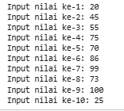
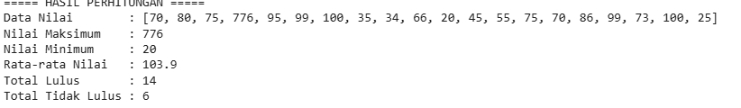
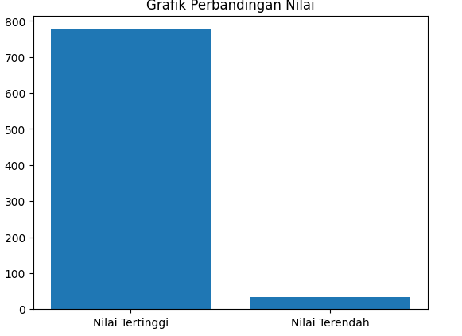
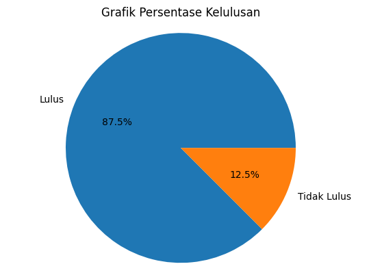

Berikut contoh **README.md** yang sesuai dengan kode pada gambar dan mengikuti ketentuan yang kamu minta.

---

# README – Implementasi Array dan Visualisasi Data Nilai Mahasiswa

## 1. Penjelasan Konsep Array

Array adalah struktur data yang digunakan untuk menyimpan sekumpulan data dengan tipe yang sama dalam satu variabel. Data dalam array disimpan secara berurutan dan dapat diakses menggunakan **index**.

Pada program ini, array digunakan untuk menyimpan **nilai mahasiswa** dalam bentuk list Python. Contohnya:

```python
data_nilai = []
```

Kemudian nilai dimasukkan menggunakan perulangan:

```python
for i in range(10):
    nilai = int(input(f"Input nilai ke-{i+1}: "))
    data_nilai.append(nilai)
```

Konsep array yang digunakan dalam program ini meliputi:

1. **Penyimpanan Data**

   * Nilai mahasiswa disimpan dalam list `data_nilai`.

2. **Akses Data dengan Index**

   * Data dapat diakses menggunakan index seperti:

   ```python
   data_nilai[i]
   ```

3. **Operasi Statistik Dasar**

   * Menghitung:

     * nilai maksimum
     * nilai minimum
     * rata-rata
     * jumlah mahasiswa lulus / tidak lulus

4. **Pengolahan Data**

   * Data dianalisis untuk menentukan status **lulus** atau **tidak lulus**.

5. **Visualisasi Data**

   * Menggunakan **Matplotlib** untuk membuat:

     * grafik batang
     * grafik pie

---

# 2. Screenshot Hasil Eksekusi

Berikut adalah hasil eksekusi program:

* Input nilai mahasiswa
* Statistik nilai
* Grafik perbandingan kelulusan
* Grafik persentase kelulusan

(Sisipkan screenshot berikut pada README)



Output yang dihasilkan program antara lain:

**Statistik Nilai**



Program juga menampilkan:

1. **Grafik Perbandingan Nilai**

   


3. **Grafik Persentase Kelulusan**

   


---

# 3. Analisis Kompleksitas

Kompleksitas waktu program sebagian besar berasal dari proses **perulangan untuk membaca dan memproses data**.

## Kompleksitas Waktu

Misalkan:

* **n = jumlah mahasiswa**

Operasi utama:

1. Input nilai

```
for i in range(n)
```

2. Menghitung statistik (max, min, rata-rata)

```
for nilai in data_nilai
```

3. Menghitung kelulusan

```
for nilai in data_nilai
```

Total kompleksitas:

**O(n)**

Artinya waktu eksekusi bertambah secara linear terhadap jumlah data mahasiswa.

## Kompleksitas Ruang

Program hanya menyimpan data nilai dalam satu array:

```
data_nilai
```

Sehingga kompleksitas ruang:

**O(n)**

---

# 4. Refleksi Pembelajaran

Dari praktikum ini saya mempelajari beberapa hal penting, yaitu:

### 1. Penggunaan Struktur Data Array

Saya memahami bagaimana menyimpan banyak data dalam satu variabel menggunakan list/array serta cara mengaksesnya menggunakan index.

### 2. Pengolahan Data

Saya belajar melakukan perhitungan statistik sederhana seperti:

* nilai maksimum
* nilai minimum
* rata-rata
* jumlah kelulusan

### 3. Perulangan dalam Python

Perulangan `for` sangat membantu untuk memproses data dalam jumlah banyak secara otomatis.

### 4. Visualisasi Data

Dengan menggunakan **Matplotlib**, data yang awalnya berupa angka dapat divisualisasikan menjadi grafik sehingga lebih mudah dipahami.

### 5. Analisis Program

Saya juga memahami bagaimana menganalisis **kompleksitas waktu dan ruang** dari sebuah program.

